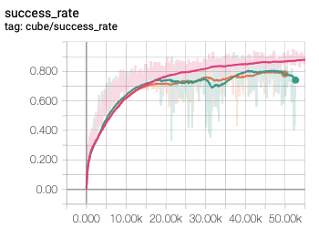
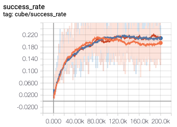

# activity-report-2019

### Currently working on: PPO

Есть ожидания от более сильной модели по сравнению с DQN. А также двухголовая архитектура ещё будет полезно в MCTS.

——— 

### 23.02.2019

1. Пробовал доразобраться, почему если награда не в виде суммы, а в виде среднего по количеству совпадений кубиков/цветов, то агент начинает учиться заметно хуже. Предполагал, что это из-за больцмановской политики (сэмплирование с нормированными выходами в качестве вероятностей вместо $\epsilon$-жадной стратегии), так как в таком случае на выходе получаются политики с более высокой энтропией (значения Q-функции ниже). Но дело, скорее всего, ещё и в фунции потерь для агента (добавление масштабирующего коэффициента в сэмплирование для уменьшения энтропии не помогало). Большой разброс значений + квадратичная функция потерь заставляют агента быстрее учить правильные шаги по сравнению с ситуацией, когда значения от 0 до 1 или считается модуль отклонения вместо квадрата.

   Зачем вообще хотелось уйти от суммы? Хотелось более удобный диапазон значений (от 0 до 1) вместо некоторого плавающего (от 0 до 324, например). Можно было, конечно нормировать просто. В итоге пришёл к тому, что это будет среднее, но с умножением на некоторый большой коэффициент, чтобы агент получал больше сигнала при обучении. Не факт, что этот "помогающий выучиться" эффект не мешает на поздних этапах.

2. Пробовал делать переход от фиктивной и шумной награды к разреженной, но исходной. Дело было в том, что с разреженной (собрался ли кубик после текущего хода) агент учился хуже, а с фиктивной наградой "доля совпавших цветов" или "доля кубиков на нужных позициях" агент учился успешнее. Была идея в том, что на начальных шагах агенту лучше выучиться быстро по фиктивной награде, а дальше ему может мешать шум, поэтому эффективнее может быть продолжить обучение на настоящей награде (агент уже умеет что-то делать ведь). Пробовал несколько вариантов смены функции награды со следующим подходом. Сначала агент учится на фиктивной награде некоторое число итераций, далее в течение некоторого числа итераций награда была сглаженным средним между фиктивной и истинной (веса изменялись линейно от числа итераций), далее обучение продолжалось с новой функции награды. Получается так, что в процессе изменения награды, агента начинает колбасить, потом он ещё некоторое время учится, но периодически его качество проваливается. Агента, для которого переключение не делалось, он не догоняет.

   

   Красным обозначен агент без смены награды, оранжевый и зелёный со сменой награды. Переключение происходило между 10k и 20k шагами. Использовался кубик 3 на 3 в 5 шагах от финального состояния. По оси ординат доля успешных сборок кубика. 

   Стоит заметить, что раньше наградой после каждого шага был прирост в показателе (в количестве совпавших цветов/позиций), а теперь либо 0, либо максимальное значение. То есть раньше изменения были плавные, а теперь редкие, но резкие. Сеть начинает колбаситься от этого. Да и переключения делают не в момент насыщения обучения по старой стратегии, а сразу после резкого роста качества.

3. Экспериментировал над стабилизацией процесса обучения при повышении сложности среды. Раньше был эффект, что при повышении сложности в некоторый момент начинает дерградировать качество (например, научились хорошо собирать кубик в 5 шагах от финального состояния, увеличили сложность и немного разучились собирать кубик в 5 шагах от финального состояния). Думал, что надо просто иногда возращаться к предыдущим уровням сложности, но возникает вопрос "как часто" и "насколько". Ещё были идеи в пользу сохранения лёгких уровней в replay memory (то есть удалять не старые, а старые, но оставлять их с какой-то вероятностью). В итоге пробовал просто делать случайную сложность среды вместо фиксированной.

   

   По оси ординат доля успешных сборок кубика 3 на 3 со сложностью 10 шагов до финального состояния.

   - Оранжевая линия — агент учится на сложности 5 первые 100k итераций, далее переключается на сложность 10 и учится ещё 100k итераций.
   - Синяя линия — агент учится на сложности 5 первые 100k итераций, далее учится на среде, где сложность случайная от 1 до 10 на каждой симуляции.
   - Красная линия (почти совпадает с синей) — агент учится на сложности 5 первые 100k итераций, далее учится на среде, где сложность случайная от 5 до 10 на каждой симуляции.

   То есть кубик начинал деградировать даже не на старом уровне сложности, а просто на текущем (не учился дальше), а при добавлении случайности хотя бы остался на месте. Нельзя сказать, что стал лучше (разве что совсем немного). Можно сказать, что из-за случайности кубик смог сохранять стабильное качество. 

### 01.01.2019

План ближайших действий (на январь).

1. Monte Carlo Tree Search

   В текущей реализации есть проблема с резким падением успешности сборки с ростом сложности среды. То есть на 5 скремблах (5 действий до конца) сеть довольно хорошо выучивает, как с жадной стратегией собирать кубик, а дальше уже начинает "путаться". Кажется, что если дать время + возможность отката, то та же самая сеть (обученная тупо под жадную стратегию) сможет собирать успешнее, так как не будет "залезать в дебри".

   Правда, обычно такие подходы используют вместе с value-предсказаниями (то есть нужно учить не только политику для действий, но и оценку состояния). В голову приходят модификации типичной работы с mcts (как в alpha zero, например, когда политика для действий нужна в качестве инициализации распределения действий, но ещё нужна оценка действий), чтобы использовать точно ту же сеть, что была обучена в простом варианте без оценки состояния. Такой proof of concept, что можно получить прирост в X% в успешности сборки, если сделать другое применение той же модели.

   Тут больше технической работы на реализацию симуляций с откатами и всем таким. Чтобы оно завелось и достаточно быстро работало (в идеале параллельно, конечно, и всё такое).

   Хочется реализовать применение MCTS для применения со сколько-нибудь любой моделью, чтобы показать, что это улучшает существующую модель (порог сложности с резкой деградацией качества отодвинется).

2. Двухголовые архитектуры

   Для симуляций в дереве потребуется хорошо оценивать состояния. В базовом варианте можно выучить что-то отдельное от сети-политики. Например, на количество ходов до конца (только если делать это влоб, то появляется то самое существенное использование особенностей среды, которыми не хотелось бы пользоваться). Но лучше, наверное, делать это одной и той же сетью. Видимо, нужно думать больше над таргетом при обучении. Без MCTS применить нельзя, можно только какое-то сферическое в вакууме качество посчитать.

   То есть хочется расширить текущую архитектуру (или получить отдельную модель), чтобы при наличии реализации MCTS попробовать такой вариант применения модели.

3. Другие подходы

   В первую очередь PPO. Q-learning всё же довольно простой и им сейчас не пользуются. Есть надежда, что можно выучить более сложную политику, кроме как максимизируя текущую награду.

   То есть реализовать обучение PPO вместо текущего простого DQN и сравнить их в лоб, без каких-то улучшений.

4. Стабилизация

   В подходе с постепенным увеличением сложности модели замечено, что с ростом сложности совсем немного растёт качество на сложной среде (это скорее про слабость всей модели) и деградирует качество там, где модель обучилась чему-то сносному.

   Приходят в голову две идеи. Во-первых, по аналогии с cycle learning rate при увеличении сложности среды отскакивать к лёгким и делать несколько шагов обучения там, постепенно возвращаясь к текущему уровню сложности. Цель "не забывать" то, что было выучено раньше. Во-вторых, полечить это же через память на состояния, на основе которых учится модель. С одной стороны, эта память как раз ограничена, чтобы не учиться на совсем старом опыте, с другой стороны, хочется в этой памяти сохранить что-то из лёгкого, чтобы оно попадало в батчи и влияло на модель.

   Хочется попробовать оба подхода на базовой модели (без двух голов, без mcts). Получится ли при более хитром увеличении сложности среды лучше учиться и "уйти дальше", а не застопориться.

5. Переход от шумной награды к разреженной

   В экспериментах с разными функциями наград (естественная награда с единственным сигналом об успехе сборки против фейковых о совпадении цветов или позиций) получилось, что ненастоящие награды лучше учатся. Это, скорее всего, связано с тем, что на небольшой сложности такие награды действительно хорошо описывают среды (ещё нет ситуаций, когда цвета совпадают, но это совсем другие кубики и поэтому до финала ещё далеко), но при увеличении сложности этот шум уже мешает. Есть идея, что нужно в некоторый момент сделать переход на естественную нешумную награду и продолжить обучение. Однако нужно соблюсти единый масштаб у наград, чтобы не поломать весь сигнал при обучении (в прошлом у меня уже были проблемы, что шумная награда в виде от 0 до 1 работала хуже, чем шумная с большим размахом — это из-за больцмановского выбора действия, но почему-то оно не исправлялось только лишь умножением/делением).

   Хочется попробовать делать переход от шумной к разреженной награде, чтобы хотя бы не ломалось всё, а лучше продолжило учиться.